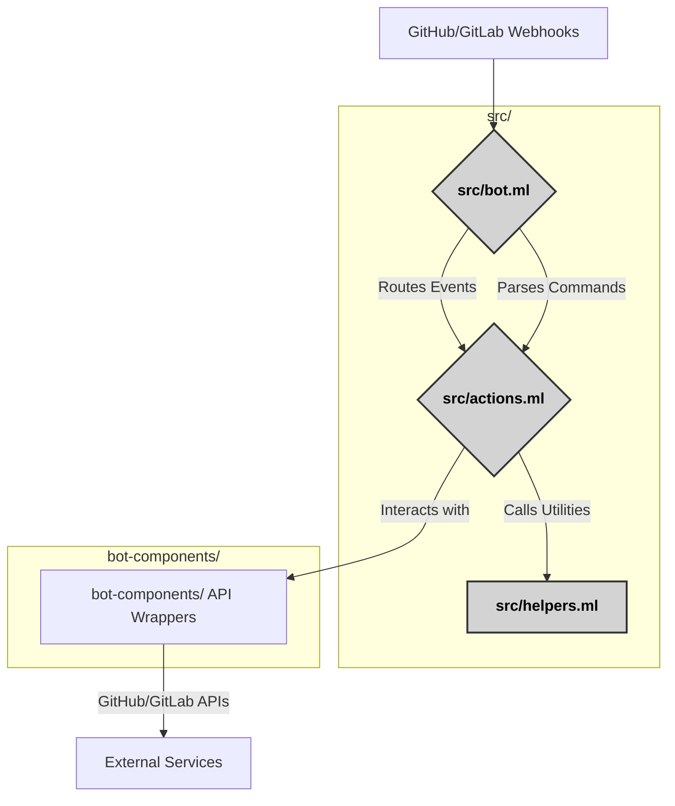
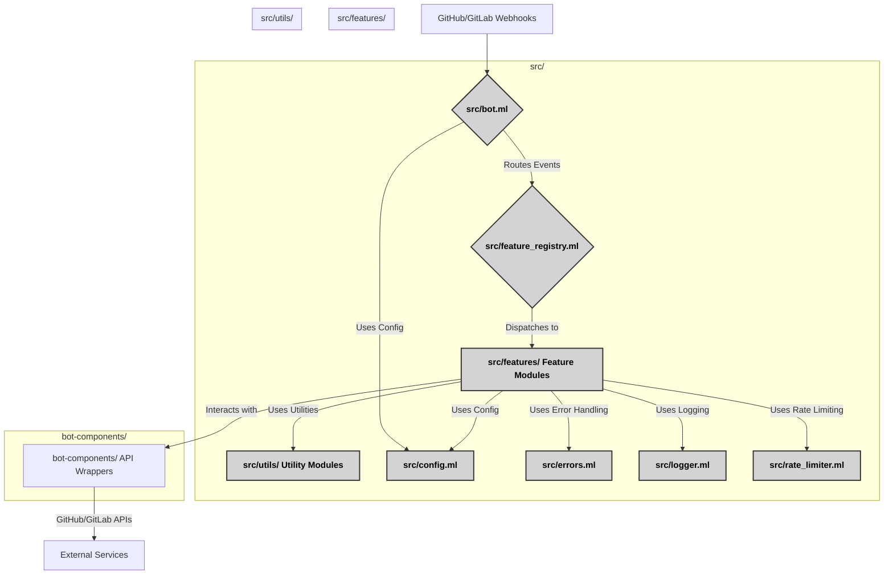

# :art: Architecture Diagrams

**Navigation:** [:house: Home](README.md) | [:arrow_left: Previous: Project Structure](08a-project-structure.md) | [:arrow_up: Code Structure Analysis](08-phase1-code-structure-analysis.md) | [Next: Feature Identification :jigsaw:](08c-feature-identification.md)

---

## 1. Current Architecture (Before Modularization)

This diagram illustrates the monolithic nature of the current bot implementation, where `bot.ml` handles webhook routing and command parsing, and `actions.ml` contains most of the business logic, relying on `helpers.ml` for various utilities.

---

## 2. Proposed Architecture (After Modularization)

This diagram shows the planned modular architecture, where `bot.ml` is simplified to pure routing, `actions.ml` is broken down into feature-specific modules, `helpers.ml` into focused utility modules, and new foundational components are introduced.

---

**Navigation:** [:house: Home](README.md) | [:arrow_left: Previous: Project Structure](08a-project-structure.md) | [:arrow_up: Code Structure Analysis](08-phase1-code-structure-analysis.md) | [Next: Feature Identification :jigsaw:](08c-feature-identification.md)
